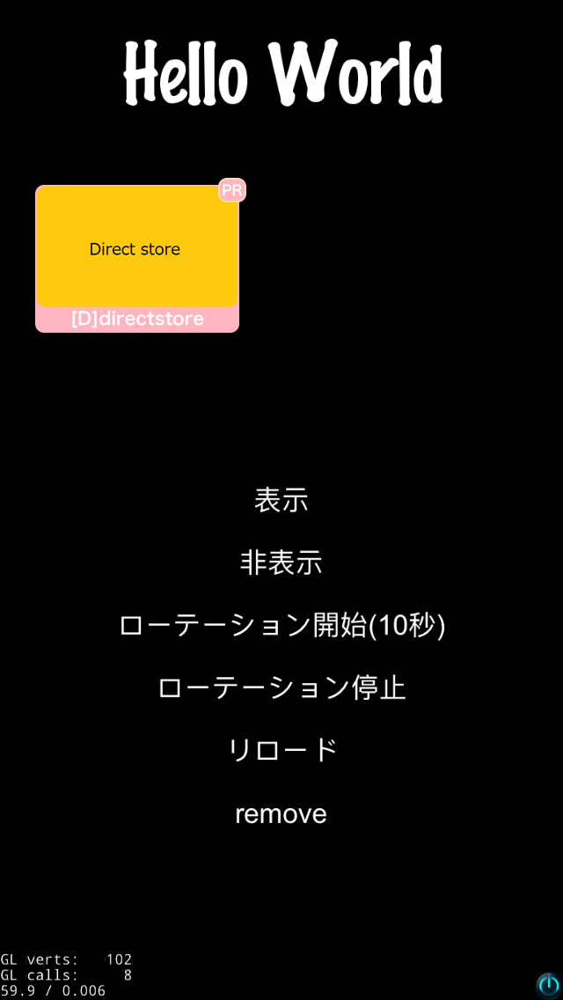
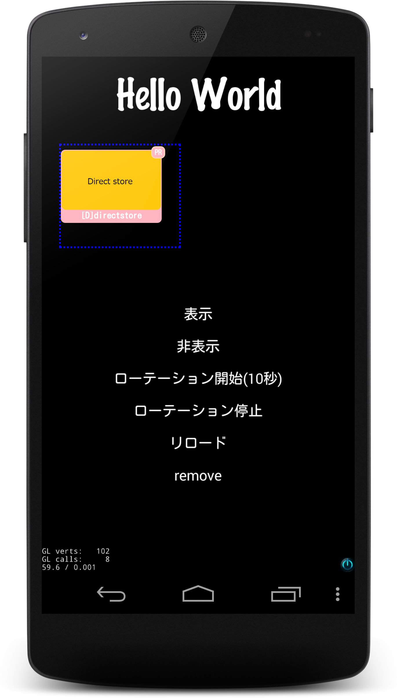
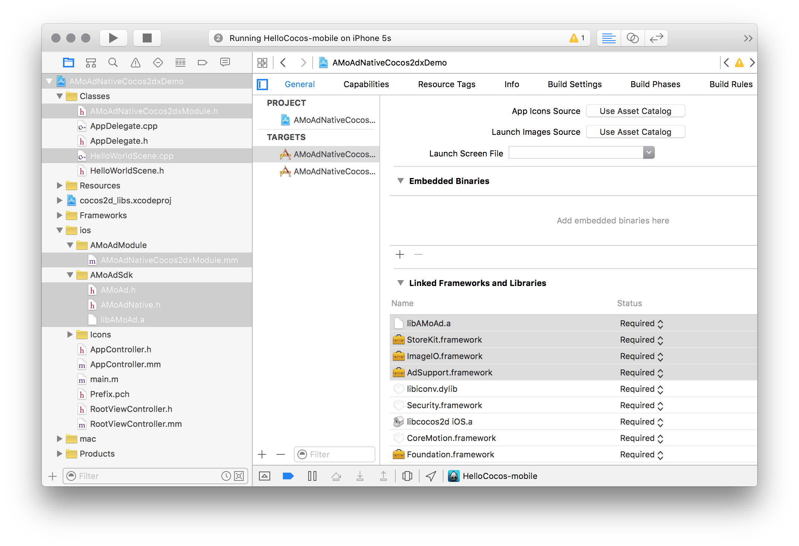
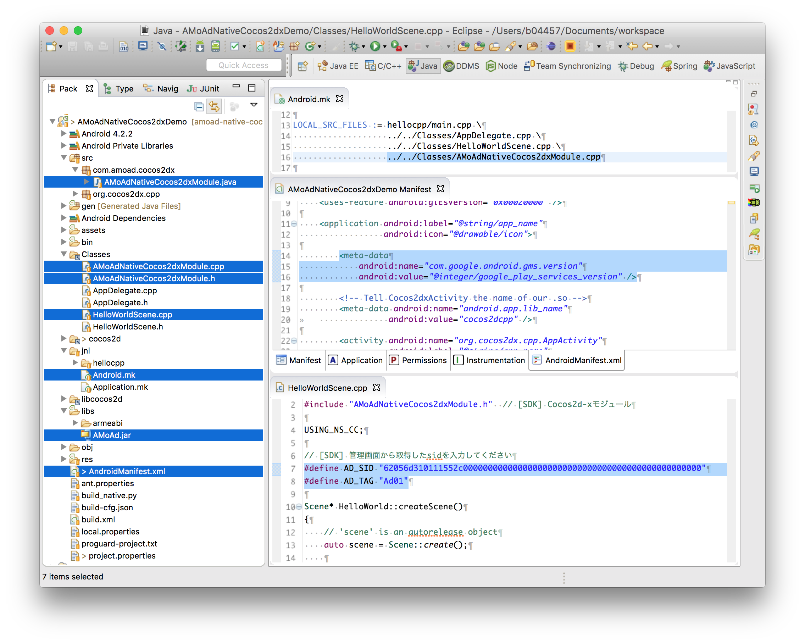
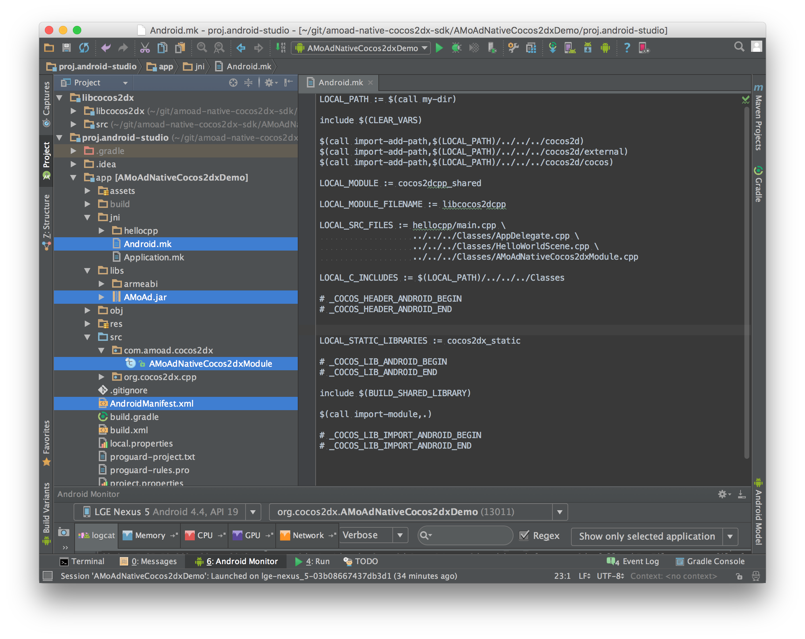

<div align="center">

</div>

# AMoAd Native Demo for Cocos2d-x




## Introduction

ネイティブ広告のスタイルを管理画面よりHTML+CSSでデザインできます（HTMLコードの画面キャプチャは例です。実際にはアプリのデザインに合わせたコードを書きます）。

## Requirements

Cocos2d-x 3.7 or later

## Installing

[ZIPをダウンロード](https://github.com/amoad/amoad-native-cocos2dx-sdk/archive/master.zip)

## Usage

管理画面から取得したsidをHelloWorldScene.cppのAD_SIDに設定する。tagは複数の広告を区別するための任意文字列です。

```cpp
// [SDK] 管理画面から取得したsidを入力してください
#define AD_SID "62056d310111552c000000000000000000000000000000000000000000000000"
#define AD_TAG "Ad01"
```

loadメソッドに以下のJSON文字列を渡すことで、広告の枠線を表示することができます。



```cpp
AMoAdNativeCocos2dxModule::load(AD_SID, AD_TAG, 20, 100, 140, 120,
  "{\"border\": \"dotted 2px #0000ff\"}");
```

## API

[AMoAd Native Cocos2d-x API](AMoAdNativeCocos2dxDemo/Classes/AMoAdNativeCocos2dxModule.h)

## Project Settings

### iOS設定例



### Android設定例

#### Eclipse



#### AndroidStudio


